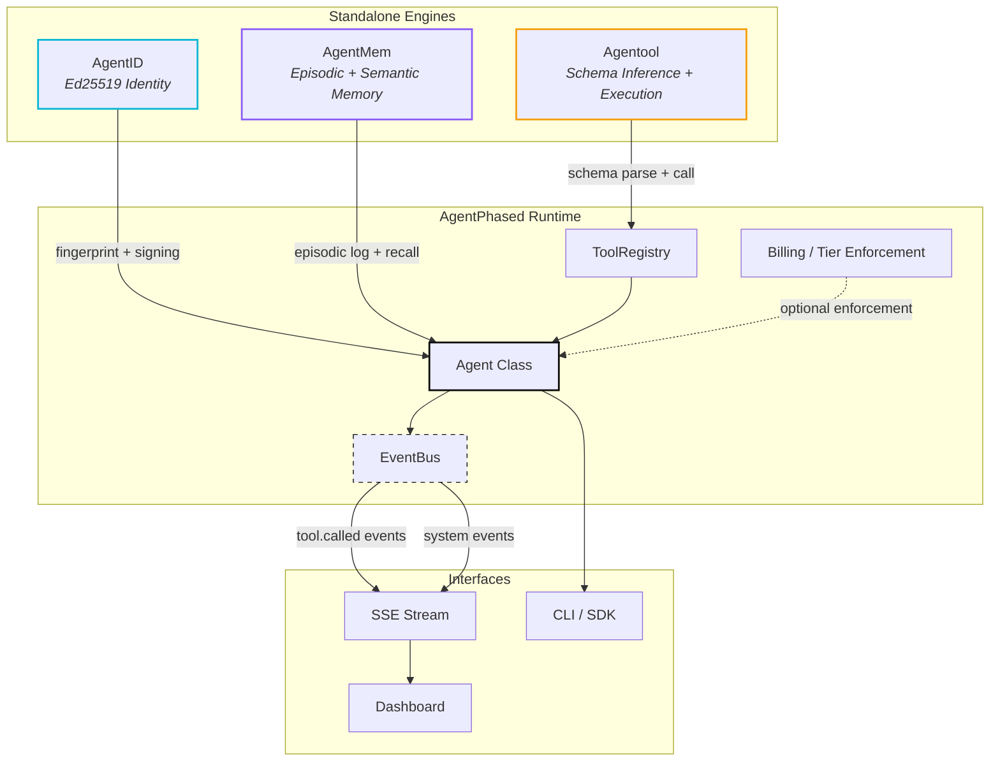

<![CDATA[# AgentPhased

**The operating system for autonomous AI agents.**

Every AI framework gives you a brain. None of them give you a body. AgentPhased is the body: cryptographic identity, structured memory, and dynamic tool execution -- three standalone engines that compose into a single, auditable runtime for agents that operate in production.

---

## Architecture

AgentPhased follows a HashiCorp-style decoupled architecture: each pillar is a fully independent project that can be installed, tested, and deployed in isolation. The unification layer glues them together through a shared event bus, not tight coupling.



---

## The Three Pillars

### AgentID -- Cryptographic Identity

Every agent gets a deterministic Ed25519 keypair derived from its name and project namespace. No certificates. No OAuth dance. Just a fingerprint that is reproducible, verifiable, and auditable.

- Deterministic key derivation from `(name, project)` tuple
- Ed25519 signing and verification
- Hex-encoded public key and fingerprint for cross-system correlation
- Zero external dependencies

```python
from agentid import AgentIdentity

identity = AgentIdentity(name="sentinel", project="acme-corp")
print(identity.fingerprint)   # deterministic, reproducible
signature = identity.sign(b"payload")
```

**Repository:** [github.com/samvardhan03/AgentID](https://github.com/samvardhan03/AgentID)

---

### AgentMem -- Persistent Memory

A compiled Rust core exposed to Python via PyO3. Episodic memory (timestamped action logs) and semantic memory (HNSW vector search over ONNX embeddings) backed by RocksDB. Not a vector database wrapper. An engine.

- Episodic memory: structured `(action, result_summary, timestamp)` tuples
- Semantic recall: HNSW approximate nearest-neighbor search
- ONNX-based embedding generation (no external API calls)
- RocksDB persistence with namespace isolation
- Compiled Rust core, not a Python wrapper around SQLite

```python
from agentmem import Memory

mem = Memory(namespace="sentinel-abc123")
mem.log_episode(action="tool.called stripe listCharges", result_summary="12 charges returned")
results = mem.recall("billing query", top_k=5)
```

**Repository:** [github.com/Muskangujar/AgentMem](https://github.com/Muskangujar/AgentMem)

---

### Agentool -- API Schema Inference and Execution

A Rust parser that reads OpenAPI specifications and raw HTML pages to automatically infer tool schemas. Includes a Tokio-based Model Context Protocol (MCP) server. The Rust core compiles to a native Python extension via PyO3.

- Automatic schema inference from OpenAPI JSON/YAML and HTML
- Native Rust parser compiled to Python via PyO3
- MCP server for tool discovery and invocation
- Request signing via AgentID integration
- Schema caching via AgentMem integration

```python
from agentool import Tool

tool = Tool("https://api.example.com/v1")
print(tool.schema)                          # auto-inferred
result = tool.call("listUsers", limit=10)
```

**Repository:** [github.com/Muskangujar/Agentool](https://github.com/Muskangujar/Agentool)

---

## Unified Quickstart

```bash
pip install agentphased
```

```python
from agentphased import Agent

# One object. Three engines. Full audit trail.
agent = Agent(name="sentinel", project="acme-corp")

# Register and call an API tool
agent.tools.add("https://api.stripe.com/v1")
result = agent.tools.call("https://api.stripe.com/v1", "listCharges")

# Every tool call is automatically logged to episodic memory
history = agent.memory.recall("stripe charges")

# The event bus streams every action for real-time telemetry
agent.bus.subscribe("tool.called", lambda e: print(f"[{e['url']}] {e['method']}"))
```

### Launch the Dashboard

```bash
git clone https://github.com/samvardhan03/agent_phased.git
cd agent_phased
pip install -e .
./start.sh
```

The dashboard runs at `http://localhost:5175` with a real-time SSE event stream connected to the internal EventBus.

---

## Design Philosophy

AgentPhased borrows its architecture from the HashiCorp ecosystem (Vault, Consul, Nomad): build each tool as a fully standalone, production-grade system, then provide a thin orchestration layer for teams that want the integrated experience.

| Principle | Implementation |
|---|---|
| **Standalone first** | Each pillar has its own repository, test suite, and release cycle |
| **Compiled cores** | Identity, memory, and tool parsing are Rust, not Python |
| **Event-driven glue** | The unification layer is a pub/sub EventBus, not inheritance |
| **No vendor lock-in** | No cloud dependencies. Runs entirely on localhost |
| **Auditable by default** | Every tool invocation is signed, logged, and streamable |

---

## Project Structure

```
agent_phased/
  agentphased/          # Python unification layer
    __init__.py         # Agent class
    bus.py              # Thread-safe EventBus
    _tool_registry.py   # Managed tool collection
    billing.py          # Tier enforcement stubs
    server.py           # FastAPI + SSE backend
  dashboard/            # React (Vite) brutalist dashboard
  apps/web/             # Marketing landing page
  tests/                # Integration test suite
  start.sh              # Orchestrator script
  pyproject.toml        # Package metadata
```

---

## Roadmap

| Status | Milestone |
|---|---|
| **Shipped** | Core Agent class with identity, memory, tools, and event bus |
| **Shipped** | Real-time SSE dashboard with live event streaming |
| **Shipped** | Billing tier enforcement stubs |
| In Progress | CLI for agent lifecycle management |
| Planned | Multi-agent coordination via shared EventBus |
| Planned | Remote agent attestation via AgentID signatures |
| Planned | Plugin system for custom memory backends |

**Current Version:** v0.1.0 -- Open Source under MIT

---

## Contributing

AgentPhased is open source. Contributions are welcome.

1. Fork the repository
2. Create a feature branch (`git checkout -b feature/your-feature`)
3. Write tests for your changes
4. Submit a pull request

---

## License

MIT License. See [LICENSE](LICENSE) for details.

---

Built by engineers who believe AI agents deserve real infrastructure, not demo scaffolding.
]]>
